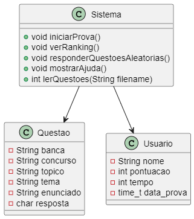
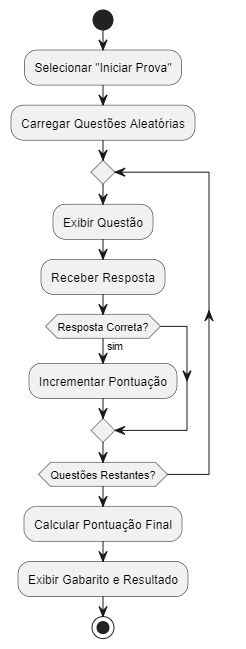

# Trabalho final TADS - DS123 - Linguagem de Programação
# 📚 Simulador de Provas de Concurso Público

## 📑 Índice
- [Trabalho final TADS - DS123 - Linguagem de Programação](#trabalho-final-tads---ds123---linguagem-de-programação)
- [📚 Simulador de Provas de Concurso Público](#-simulador-de-provas-de-concurso-público)
  - [📑 Índice](#-índice)
  - [📜 Descrição](#-descrição)
  - [✨ Funcionalidades](#-funcionalidades)
  - [🔧 Requisitos](#-requisitos)
  - [⚙️ Instalação](#️-instalação)
  - [🚀 Uso](#-uso)
  - [🏗 Arquitetura do Sistema](#-arquitetura-do-sistema)
  - [📊 Diagramas](#-diagramas)
    - [🎨 Diagrama de Caso de Uso](#-diagrama-de-caso-de-uso)
    - [🏷 Diagrama de Classes](#-diagrama-de-classes)
    - [🛠 Diagrama de Atividades](#-diagrama-de-atividades)
    - [📈 Diagrama de Estado](#-diagrama-de-estado)
  - [🤝 Contribuição](#-contribuição)

## 📜 Descrição
O **Simulador de Provas** é uma ferramenta desenvolvida em linguagem C para ajudar candidatos a concursos públicos a praticar questões de provas de diversas áreas. O sistema permite que os usuários realizem provas simuladas, vejam seu desempenho e consultem rankings.

## ✨ Funcionalidades
- 📝 Iniciar uma prova simulada com questões aleatórias.
- ✅ Responder questões e receber feedback imediato.
- 📊 Exibir a pontuação final e o gabarito ao final da prova.
- 🏆 Consultar ranking dos melhores desempenhos.
- 🔄 Responder questões aleatórias sem limite de tempo.
- 🆘 Exibir ajuda e instruções detalhadas.

## 🔧 Requisitos
- 🖥 Compilador C (como GCC).
- 💻 Terminal para execução do programa.
- 📂 Arquivo de questões formatadas.

## ⚙️ Instalação
1. Clone o repositório:
    ```bash
    git clone https://github.com/seu-usuario/simulador-de-provas.git
    ```
2. Compile o código:
    ```bash
    gcc simulador_provas.c -o simulador_provas
    ```

## 🚀 Uso
1. Execute o programa:
    ```bash
    ./simulador_provas
    ```
2. Siga as instruções no menu para iniciar uma prova, ver ranking, responder questões aleatórias ou acessar a ajuda.

## 🏗 Arquitetura do Sistema
O sistema segue uma arquitetura monolítica e é dividido em várias funções para modularizar o comportamento do sistema e promover a reutilização de código. As principais estruturas de dados são `Questao` e `Usuario`.

## 📊 Diagramas

### 🎨 Diagrama de Caso de Uso
 

### 🏷 Diagrama de Classes


### 🛠 Diagrama de Atividades


### 📈 Diagrama de Estado


## 🤝 Contribuição
Contribuições são bem-vindas! Sinta-se à vontade para abrir issues ou pull requests para melhorias, correções de bugs ou novas funcionalidades.


